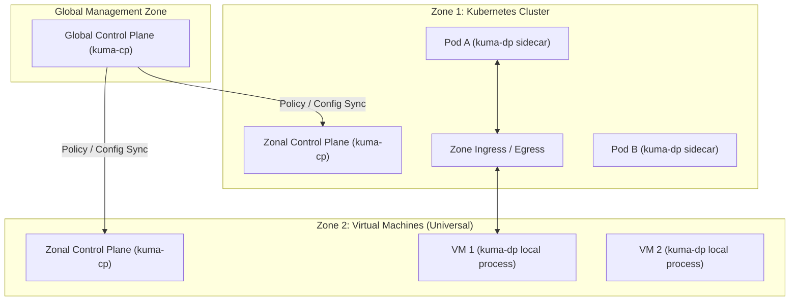

# Kuma and Kong Mesh: VM-to-Kubernetes Integration & Cost Analysis

This document analyzes the architectural fit and cost implications of adopting **Kuma** (open-source) or **Kong Mesh** (enterprise) as a service mesh connecting Virtual Machines (VMs) and Kubernetes (K8s) clusters, compared to the current **Istio**-based implementation.

---

## 1. Architectural Fit: Kuma/Kong Mesh vs. Istio

### Kuma's Native Hybrid Architecture (Universal Mode)
Kuma was designed from the ground up to support heterogeneous environments. It uses a **Global / Zonal Control Plane** architecture and features two deployment modes:
* **Kubernetes Mode:** Deployed directly via CRDs, sidecars are injected automatically.
* **Universal Mode:** Deployed on raw virtual machines, bare metal, or physical servers. Workloads register as `Dataplane` resources.

### Technical Comparison: VM-Kube Connectivity

| Feature | Istio (Sidecar / Ambient) | Kuma / Kong Mesh (Universal) |
| :--- | :--- | :--- |
| **VM Support Status** | Complex manual onboarding; unsupported in Ambient mode (forces hybrid sidecar setups). | First-class citizen (Universal Mode). Simple `kuma-dp` binary process. |
| **Multi-Zone / Multi-Cluster Routing** | Requires complex manual East-West Gateways, custom DNS proxying, and flat/multi-network routing rules. | Native out-of-the-box Zone Ingress/Egress. Seamless routing across zones via `.mesh` DNS. |
| **VM Bootstrapping & Security** | Manual creation of tokens, certs, `cluster.env`, and `mesh.yaml`. Dynamic configuration requires custom tooling. | Straightforward token-based node registration; automatically manages certificate rotation via built-in mTLS engines. |
| **Policy Application** | Namespace-scoped or selector-scoped. Hybrid mode (Ambient pods + Sidecar VMs) causes RBAC policy mapping issues. | Policies are globally defined and automatically compiled/routed to all Zones (K8s and VM). |

---

## 2. Cost Analysis

When comparing the costs of Istio, Kuma, and Kong Mesh, you must divide the cost into three categories: **Licensing**, **Infrastructure (Resources)**, and **Operational (Engineering Hours)**.

### A. Licensing Costs

| Service Mesh | License | Pricing Model | Estimated Annual Cost |
| :--- | :--- | :--- | :--- |
| **Istio** (OS) | Apache 2.0 | Free | $0 |
| **Kuma** (OS) | Apache 2.0 (CNCF) | Free | $0 |
| **Kong Mesh** (Enterprise) | Proprietary Commercial | Subscription billed **per Data Plane Proxy (DPP)**. | Typically starts at $15k-$50k minimum annual contract, scaling with proxy count (~$100-$300/proxy/yr). |

> [!NOTE]
> Kong Mesh provides enterprise features on top of Kuma, including FIPS compliance, advanced plugins (OIDC, rate-limiting, custom gateway integrations), role-based access control (RBAC) for the GUI, and 24/7 Enterprise SLA Support.

### B. Infrastructure & Resource Costs
Both Istio and Kuma run **Envoy** under the hood as the data plane proxy (`istio-proxy` vs `kuma-dp`), meaning CPU and memory footprints *per proxy* are virtually identical:
* **Memory usage per proxy:** ~50MB to ~150MB depending on the size of the cluster configuration.
* **CPU usage per proxy:** Scales linearly with requests per second (RPS).

#### Key Structural Differences in Resource Overhead:
1. **Control Plane Overhead:**
   * **Istio:** Runs `istiod` (~1GB-2GB RAM).
   * **Kuma:** Runs a Global CP and Zonal CPs (`kuma-cp` is written in Go, very lightweight, ~200MB-500MB RAM each). While you run more instances in a multi-zone layout, the aggregate memory consumption is comparable or slightly lower than Istio.
2. **Ambient Mode (Sidecarless) vs Sidecar:**
   * If you use **Istio Ambient**, Kubernetes nodes share a single `ztunnel` proxy. This saves massive amounts of memory compared to running a sidecar on every pod.
   * **Kuma/Kong Mesh** does not currently have a mature, production-ready sidecarless architecture. If you migrate from Istio Ambient to Kuma, you will need to revert to sidecars (`kuma-dp`) on all pods, which will **increase your Kubernetes cluster resource overhead** by 30-50% depending on pod density.

### C. Operational & Engineering Costs (Day-2 Operations)
This is where **Kuma/Kong Mesh** provides significant cost savings over **Istio**:
* **Complexity / Time to Deploy VM:** Setting up a VM in Istio often takes a platform engineer 2-4 days of debugging network gateways, certs, and DNS. Kuma's Universal mode can be automated via Ansible in a few hours.
* **Troubleshooting SLA:** Because Kuma handles multi-zone address propagation and DNS resolution natively, debugging routing issues between VM and Kube is significantly faster.
* **Support SLA:** Kong Mesh enterprise includes direct access to Kong engineers, reducing the risk of downtime or prolonged troubleshooting in production.

---

## Summary & Recommendations

### Choose **Kuma (Open-Source)** if:
1. **VM workloads are critical** but you want to avoid proprietary licensing fees. Kuma gives you first-class VM integration and multi-zone DNS routing for free.
2. You want a much lower learning curve and simpler operations than open-source Istio.

### Choose **Kong Mesh (Enterprise)** if:
1. You have strict compliance requirements (FIPS, corporate RBAC for control planes).
2. You require 24/7 vendor support with guaranteed SLAs.
3. You are already utilizing the **Kong Gateway / Kong Konnect** ecosystem, which allows unified policy management across API Gateways and Service Meshes.

### Stick with **Istio** if:
1. You are heavily utilizing **Istio Ambient Mode** in Kubernetes to minimize sidecar memory overhead, and VMs are only a minor part of your architecture.
2. You want to avoid vendor lock-in and have a mature internal team capable of maintaining complex network routing, east-west gateways, and custom DNS resolution.
